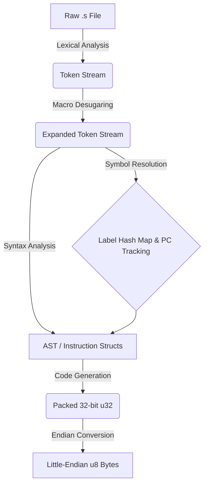

# Pure-V: The Universal Bare-Metal RISC-V Assembler


A rigorous, purist RISC-V assembler written entirely from scratch in Rust. 

Pure-V is engineered to be a comprehensive systems programming tool. It deliberately bypasses high-level parsing libraries (like `regex` or `nom`) in favor of a custom, multi-phase compiler pipeline. The ultimate objective is to provide a mathematically infallible, `#![no_std]` compliant assembler capable of compiling any standard RISC-V extension (RV32/64-IMAFD) entirely on bare metal.

## 🧠 Engineering Philosophy & Architecture

This toolchain enforces a strict separation of concerns, ensuring that lexical analysis, macro desugaring, and bitwise binary generation are perfectly decoupled.



### Core Technical Directives

* **Zero External Dependencies:** The pipeline is built exclusively with standard Rust types. The architecture is currently being refactored to drop `std` entirely, enabling the assembler itself to run on embedded microcontrollers.
* **Maximum Architectural Rigidity:** The codebase is locked down with hyper-strict `Cargo.toml` linting, strictly forbidding `unwrap`, arithmetic side-effects, implicit conversions, and panics.
* **Compiler-Injected Error Tracking:** Implements a custom `AssemblerError` struct that traces exactly where a parsing fault originated in the pipeline without ungraceful thread panicking.
* **Golden Master Testing:** Output binaries are strictly verified against the official `riscv64-unknown-elf` GNU toolchain via automated CI pipelines.

## 🚀 Current State: v0.1.0

The current release provides a highly robust foundation, fully supporting the **RV32I Base Integer Instruction Set** (excluding variable-width CSR/System operations).

Supported instructions include: `add`, `addi`, `sub`, `and`, `andi`, `or`, `ori`, `xor`, `xori`, `slli`, `srli`, `lw`, `lb`, `sw`, `sb`, `beq`, `bne`, `blt`, `bge`, `jal`, `jalr`, and many more.

### Quick Start

```bash
git clone [https://github.com/JeronimoCapelle/Pure-V.git](https://github.com/JeronimoCapelle/Pure-V.git)
cd Pure-V
cargo build --release
cargo run --release -- input.txt -o output.bin

```

## 🗺️ The Expansion Roadmap

Pure-V is designed to scale horizontally. The upcoming milestones focus on expanding ISA support, eliminating overhead, and proving performance.

### Phase 1: Macro Expansion & Pipeline Refactoring

* [ ] Implement Token-Level Macro Desugaring (translating pseudo-instructions like `li` and `call` into base instructions before symbol resolution).
* [ ] Support dynamic PC-counter tracking to handle variable-width instruction outputs.

### Phase 2: ISA Expansion

* [ ] Implement the remaining RV32I system instructions (`ecall`, `ebreak`, `fence`).
* [ ] Extend architecture to **RV64I** (Doubleword memory operations and `*W` arithmetic).
* [ ] Modularize `Instruction` traits to support the **'M'** (Multiplication) and **'F'/'D'** (Floating Point) extensions.

### Phase 3: Embedded Compliance & Performance

* [ ] Complete `#![no_std]` compliance by decoupling File I/O from the core parsing and generation logic.
* [ ] Establish automated performance benchmarking (parsing speed, memory footprint, and generation time) against other standard assemblers.
* [ ] Output to standard object files (`.o` / `.elf`).

## ⚖️ License

Distributed under the CC0 1.0 Universal License. See `LICENSE` for more information.