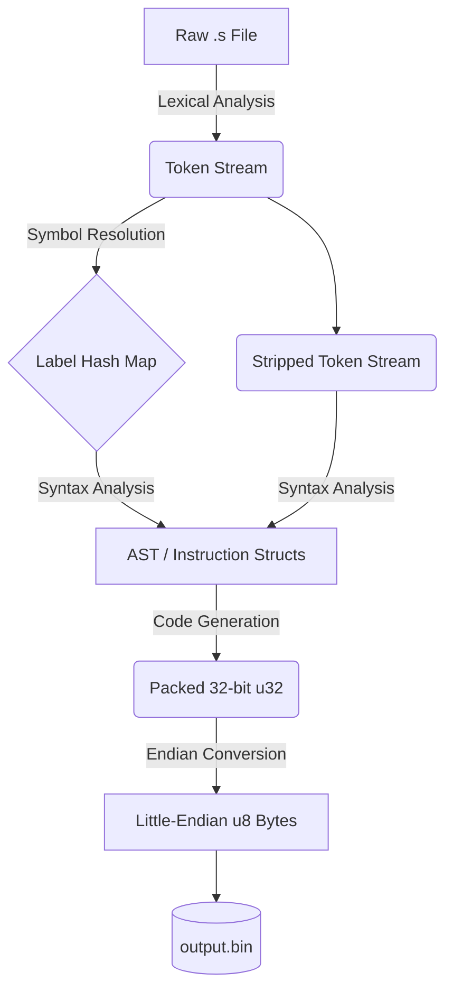

# Forge RV32I: A Zero-Dependency RISC-V Assembler


A rigorous, purist RISC-V 32I assembler written entirely from scratch in Rust. 

Developed as a capstone-level pursuit in Informatics Engineering, this toolchain deliberately bypasses high-level parsing libraries (like `regex` or `nom`). It was engineered to demonstrate a foundational mastery of bare-metal systems programming, compiler architecture, memory safety, and the intricate hardware quirks of the RISC-V instruction set.

## 🧠 Engineering Philosophy & Architecture

This is not a simple script that maps strings to numbers. It is a fully decoupled, multi-phase compiler pipeline. The architecture forces a strict separation of concerns, ensuring that memory references, bitwise operations, and endianness are handled exactly as physical hardware expects.



### Core Technical Achievements

* **Zero External Dependencies:** The lexical analyzer and recursive descent parser are built entirely from standard Rust types, paving the way for eventual `#![no_std]` embedded compliance.
* **Compiler-Injected Error Tracking:** Implements a custom `TrackedError` struct that uses Rust's AST macros (`line!()`, `file!()`) at build-time to trace exactly where a parsing fault originated in the source code without ungraceful thread panicking.
* **Mathematical Bit-Scrambling:** Native handling of RISC-V's notoriously complex immediate packing (e.g., S-Type and B-Type bit fracturing, Two's Complement sign-extension, and LSB hardware clearing).
* **Strict GNU Binutils Verification:** The test suite does not rely on hand-calculated offsets. It uses a custom integration pipeline that asserts the assembler's output byte-for-byte against golden reference binaries generated by the official `riscv64-unknown-elf` GNU toolchain.

## 🚀 Quick Start

Ensure you have [Rust and Cargo](https://rustup.rs/) installed.

1. **Clone the repository:**
```bash
git clone [https://github.com/JeronimoCapelle/Pure-RISCV32I-Assembler.git](https://github.com/JeronimoCapelle/Pure-RISCV32I-Assembler.git)
cd forge-rv32i

```


2. **Build the assembler:**
```bash
cargo build --release

```


3. **Assemble a file:**
```bash
cargo run --release -- input.s

```


*This will generate a little-endian `output.bin` file in the root directory, ready to be flashed to memory or run in a RISC-V simulator.*

## 🧪 Testing Methodology

This project utilizes both module-level Unit Tests and full-pipeline Integration Tests. The integration test suite compiles complex, multi-instruction `.s` files (containing forward/backward branching, memory offsets, and negative immediates) and strictly verifies the resultant `u8` byte array against verified GNU assembler output.

Run the test suite via Cargo:

```bash
cargo test

```

## 🗺️ Roadmap

The foundation is built, but the architecture is designed to scale. Upcoming milestones include:

* [ ] **Instruction Parity:** Implement the remaining 19 base instructions of the `RV32I` specification.
* [ ] **Pseudo-Instruction Expansion:** Support for `li`, `mv`, `ret`, `call`, and `j`, including `auipc` + `jalr` sign-extension compensation.
* [ ] **`#![no_std]` Compliance:** Refactor file I/O out of the core library to allow the assembler to run on bare-metal embedded microcontrollers.
* [ ] **ELF File Generation:** Transition from raw `.bin` outputs to generating standard Object (`.o`) and Executable Linkable Format (`.elf`) files with populated `.text`, `.data`, and symbol sections.
* [ ] **Assembler Directives:** Support for `.align`, `.word`, `.byte`, and `.section` data allocations.

## ⚖️ License

Distributed under the CC0 1.0 Universal License. See `LICENSE` for more information.