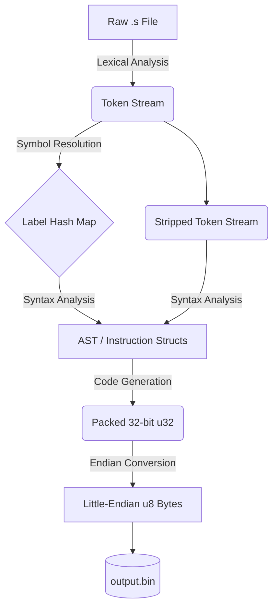

# Pure RV32I: A Zero-Dependency RISC-V Assembler


A rigorous, purist RISC-V 32I assembler written entirely from scratch in Rust. 

Developed as a capstone-level pursuit in Informatics Engineering, this toolchain deliberately bypasses high-level parsing libraries (like `regex` or `nom`). It was engineered to demonstrate a foundational mastery of bare-metal systems programming, compiler architecture, memory safety, and the intricate hardware quirks of the RISC-V instruction set.

## 🧠 Engineering Philosophy & Architecture

This is not a simple script that maps strings to numbers. It is a fully decoupled, multi-phase compiler pipeline. The architecture forces a strict separation of concerns, ensuring that memory references, bitwise operations, and endianness are handled exactly as physical hardware expects.



### Core Technical Achievements

* **Zero External Dependencies:** The lexical analyzer and recursive descent parser are built entirely from standard Rust types, paving the way for eventual `#![no_std]` embedded compliance.
* **Compiler-Injected Error Tracking:** Implements a custom `AssemblerError` struct that uses Rust's `Location::caller()` at build-time to trace exactly where a parsing fault originated in the pipeline without ungraceful thread panicking.
* **Mathematical Bit-Scrambling:** Native handling of RISC-V's notoriously complex immediate packing (e.g., S-Type and B-Type bit fracturing, Two's Complement sign-extension, and LSB hardware clearing).
* **Maximum Architectural Rigidity:** The codebase is locked down with hyper-strict `Cargo.toml` linting, strictly forbidding `unwrap`, arithmetic side-effects, implicit conversions, and panics to guarantee mathematical infallibility.

## 🚀 Quick Start

Ensure you have [Rust and Cargo](https://rustup.rs/) installed.

1. **Clone the repository:**

```bash
git clone [https://github.com/JeronimoCapelle/Pure-RISCV32I-Assembler.git](https://github.com/JeronimoCapelle/Pure-RISCV32I-Assembler.git)
cd Pure-RISCV32I-Assembler

```

2. **Build the assembler:**

```bash
cargo build --release

```

3. **Assemble a file:**

```bash
cargo run --release -- input.txt

```

*This will currently generate a little-endian `output.bin` file in the root directory, ready to be flashed to memory or run in a RISC-V simulator.*

## ⚙️ Supported Instructions (v0.1.0)

The assembler currently supports 21 core instructions from the RV32I base integer instruction set, alongside label generation and offset resolution:

* **Arithmetic & Logical:** `add`, `addi`, `sub`, `and`, `andi`, `or`, `ori`, `xor`, `xori`, `slli`, `srli`
* **Memory Load/Store:** `lw`, `lb`, `sw`, `sb`
* **Control Flow (Branching & Jumps):** `beq`, `bne`, `blt`, `bge`, `jal`, `jalr`

## 🧪 Testing Methodology

This project utilizes both module-level Unit Tests and full-pipeline Integration Tests. The integration test suite compiles complex, multi-instruction strings (containing forward/backward branching, memory offsets, and negative immediates) and strictly verifies the resultant `u8` byte array against verified target architectures.

Run the test suite via Cargo:

```bash
cargo test

```

## 🗺️ Roadmap

The v0.1.0 foundation is built, but the architecture is designed to scale. Upcoming milestones include:

* [ ] **CLI Flexibility:** Implement output file path arguments (e.g., `-o custom.bin`) to replace the hardcoded `output.bin` generation.
* [ ] **Instruction Parity:** Implement the remaining instructions of the `RV32I` base specification.
* [ ] **Pseudo-Instruction Expansion:** Support for `li`, `mv`, `ret`, `call`, and `j`.
* [ ] **Automated GNU Binutils Verification:** Transition tests from hardcoded byte arrays to an automated CI pipeline that tests against the official `riscv64-unknown-elf` GNU toolchain.
* [ ] **`#![no_std]` Compliance:** Refactor file I/O out of the core library to allow the assembler to run on bare-metal embedded microcontrollers.

## ⚖️ License

Distributed under the CC0 1.0 Universal License. See `LICENSE` for more information.